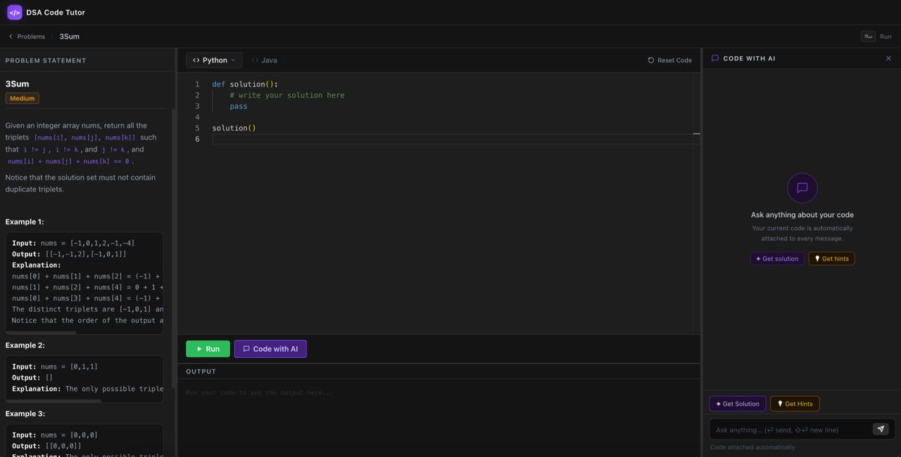

# DSA Code Tutor



An AI-powered coding tutor for Data Structures & Algorithms. Browse real LeetCode problems, write your solution, and get contextual hints or a full optimal solution — powered by Groq LLMs.

## Features

- **LeetCode Problem Browser** — Browse and filter problems by 25 DSA topics (Array, Tree, DP, Graph, and more) using the LeetCode GraphQL API
- **AI Tutor (Socratic style)** — Ask for hints or solutions; the tutor guides you rather than giving answers away, with full conversational context across turns
- **Live Code Execution** — Run Python and Java code directly in the browser; results appear instantly in the output panel
- **Structured LLM Responses** — Every AI response includes a main reply, optional code suggestion, explanation, and misconception callout
- **3-panel IDE layout** — Resizable columns for problem description, code editor (Monaco), and chat panel

## Tech Stack

- **Frontend** — React 19, Vite, Tailwind CSS v4, Monaco Editor
- **Backend** — FastAPI, LangChain + LangGraph, Groq API
- **Code Execution** — Python 3 and Java run locally via subprocess

---

## Prerequisites

- Python 3.13+
- Node.js 18+
- Java (JDK) — required to run Java code submissions
- A [Groq API key](https://console.groq.com/)

---

## Setup

### 1. Clone the repo

```bash
git clone https://github.com/your-username/dsa-code-tutor.git
cd dsa-code-tutor
```

### 2. Create a `.env` file

Create a `.env` file in the project root:

```env
GROQ_API_KEY=your_groq_api_key_here
```

### 3. Set up the Python environment

```bash
python3 -m venv .venv
source .venv/bin/activate        # Windows: .venv\Scripts\activate
pip install -e .
```

### 4. Install frontend dependencies

```bash
cd frontend
npm install
cd ..
```

---

## Running the App

You need **two terminals** — one for the backend, one for the frontend.

### Terminal 1 — Backend (FastAPI)

```bash
source .venv/bin/activate        # Windows: .venv\Scripts\activate
uvicorn backend.main:app --reload --port 8000
```

The API will be available at `http://localhost:8000`.

### Terminal 2 — Frontend (Vite dev server)

```bash
cd frontend
npm run dev
```

Open `http://localhost:5173` in your browser.

> Vite proxies `/ask-dsa`, `/run`, and `/leetcode` to the backend automatically — no CORS issues.

---

## Project Structure

```
dsa-code-tutor/
├── backend/
│   ├── main.py        # FastAPI app — /ask-dsa, /run, /leetcode endpoints
│   ├── schemas.py     # Pydantic request/response models
│   └── tutor.py       # LangChain LLM logic with message history
├── frontend/
│   └── src/
│       ├── App.jsx                  # Router setup (ProblemsPage / SolverPage)
│       ├── api.js                   # Fetch wrappers for backend
│       ├── languages.js             # Supported languages config + default templates
│       ├── topics.js                # 25 DSA topic definitions for filtering
│       ├── pages/
│       │   ├── ProblemsPage.jsx     # Problem browser with topic sidebar
│       │   └── SolverPage.jsx       # 3-panel solver UI with resizable columns
│       └── components/
│           ├── ChatPanel.jsx        # Conversational AI chat with message history
│           ├── CodeEditor.jsx       # Monaco editor wrapper
│           ├── LanguageSelector.jsx # Language pill toggle
│           ├── Navbar.jsx           # Top navigation bar
│           ├── OutputPanel.jsx      # Code execution results display
│           ├── ProblemDisplay.jsx   # Problem statement renderer
│           ├── ProblemInput.jsx     # Custom problem input form
│           └── ProblemRow.jsx       # Problem list row with difficulty badge
├── util/                # Scratch/exploration scripts
├── pyproject.toml       # Python project & dependency config
└── .env                 # API keys (not committed)
```

---

## API Endpoints

| Method | Path | Description |
|--------|------|-------------|
| GET | `/leetcode/problems?tag=&skip=&limit=` | Fetch paginated LeetCode problems by topic |
| GET | `/leetcode/problem/{titleSlug}` | Fetch full problem description and test cases |
| POST | `/ask-dsa` | Send problem + code + chat history; receive hints or solution |
| POST | `/run` | Execute code (Python or Java) and return stdout/stderr |

---

## Supported Languages

| Language | Execution |
|----------|-----------|
| Python | `python3` subprocess |
| Java | `javac` + `java` subprocess |